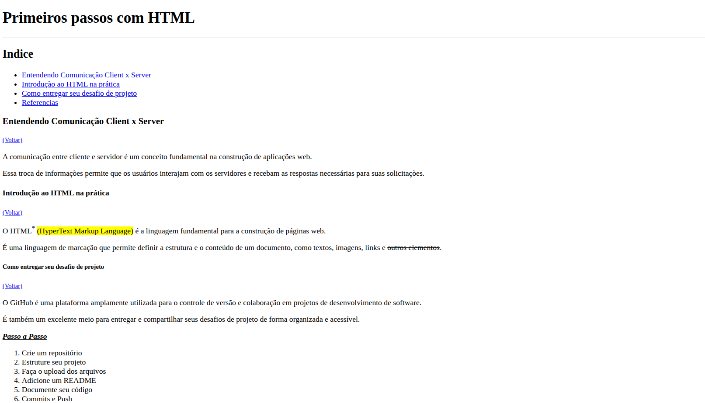

<h1><strong>Getting Started With HTML</strong></h1>

<h2><strong>Descrição</strong></h2>

  Este repositório foi criado com o objetivo de desenvolver uma página web simples, utilizando as principais tags HTML aprendidas no primeiro módulo da Formação HTML da DIO.  
  O foco do projeto é consolidar o conhecimento adquirido, experimentando diferentes elementos HTML e entendendo suas funcionalidades, hierarquias e aplicações práticas dentro de uma estrutura básica de documento.

<h2><strong>Funcionalidades</strong></h2>
<ul>
  <li align="justify">Exemplos de formatação de texto utilizando tags semânticas e não semânticas.</li>
  <li align="justify">Uso completo da hierarquia de títulos (<strong>h1 a h6</strong>).</li>
  <li align="justify">Aplicação de tags como <strong>mark, del, abbr, sup e sub</strong> para enriquecer o conteúdo.</li>
  <li align="justify">Listas ordenadas e não ordenadas com links internos e externos.</li>
  <li align="justify">Exploração de elementos básicos de estruturação de página.</li>
</ul>

<h2><strong>Demonstração do Projeto</strong></h2>

  
   
  <a href="https://williandpg.github.io/getting-started-with-html/" target="_blank"><strong>Acesse a demonstração</strong></a>

<h2><strong>Tecnologias Utilizadas</strong></h2>
<ul>
  <li align="justify">
    <a href="https://developer.mozilla.org/pt-BR/docs/Web/HTML"><strong>HTML</strong></a>: Linguagem de marcação utilizada para estruturar a página web.
  </li>
  <li align="justify">
    <a href="https://code.visualstudio.com/"><strong>VS Code</strong></a>: Editor de código utilizado durante o desenvolvimento.
  </li>
  <li align="justify">
    <a href="https://www.google.com/intl/pt-BR/chrome/"><strong>Navegador (Chrome)</strong></a>: Utilizado para visualizar a página em tempo real.
  </li>
</ul>

<h2><strong>Estrutura do Projeto</strong></h2>

A estrutura do projeto é organizada da seguinte forma:

<pre><code>
/
├── assets
│   └── site-html.png
├── index.html
└── README.md
</code></pre>

<h2><strong>Contato</strong></h2> 

 
  <strong>Willian Gonçalves</strong> | 
  <a href="https://www.linkedin.com/in/williandpg/" target="_blank"><strong>LinkedIn</strong></a> | 
  <a href="https://github.com/williandpg" target="_blank"><strong>Github</strong></a> | 
  <a href="https://williandpg.github.io/" target="_blank"><strong>Portfólio</strong></a> | 
  <a href="mailto:goncalves.wdp@outlook.com" target="_blank"><strong>Email</strong></a> 

 

<h2><strong>Créditos</strong></h2> 

 Este exercício foi desenvolvido como parte da Formação HTML da DIO. 
 
  

 
  
<strong>English Version</strong>
 
  
  <h1><strong>Getting Started With HTML</strong></h1> 
  
  <h2><strong>Description</strong></h2> 
  
 This repository was created with the purpose of developing a simple web page using the main HTML tags learned in the first module of the DIO HTML training. The project focuses on consolidating the acquired knowledge by exploring different HTML elements, their hierarchy and practical applications inside a basic document structure. 
 

  <h2><strong>Features</strong></h2> 
    <ul> 
      <li align="justify">Text formatting using semantic and non-semantic tags.</li> 
      <li align="justify">Complete use of heading hierarchy (<strong>h1 to h6</strong>).</li> 
      <li align="justify">Use of <strong>mark, del, abbr, sup and sub</strong> to enrich content.</li> 
      <li align="justify">Ordered and unordered lists with internal and external links.</li> 
      <li align="justify">Exploration of basic HTML structuring elements.</li> 
    </ul> 
    
  <h2><strong>Project Demonstration</strong></h2> 
  
 
     
      
    <a href="https://williandpg.github.io/getting-started-with-html/" target="_blank"><strong>Access the demonstration</strong></a> 
  
 
  
  <h2><strong>Technologies Used</strong></h2> 
    <ul> 
      <li align="justify"> <a href="https://developer.mozilla.org/pt-BR/docs/Web/HTML"><strong>HTML</strong></a>: Markup language used to structure the web page. </li> 
      <li align="justify"> <a href="https://code.visualstudio.com/"><strong>VS Code</strong></a>: Code editor used to develop the project. </li> 
      <li align="justify"> <a href="https://www.google.com/intl/pt-BR/chrome/"><strong>Browser (Chrome)</strong></a>: Used to visualize the page in real time. </li> 
    </ul> 
    
  <h2><strong>Project Structure</strong></h2> 
  
The project structure is organized as follows:

  <pre><code>
  /
  ├── assets
  │   └── site-html.png
  ├── index.html
  └── README.md
  </code></pre>

  <h2><strong>Contact</strong></h2> 
  
 <strong>Willian Gonçalves</strong> | 
  <a href="https://www.linkedin.com/in/williandpg/" target="_blank"><strong>LinkedIn</strong></a> | 
  <a href="https://github.com/williandpg" target="_blank"><strong>GitHub</strong></a> | 
  <a href="https://williandpg.github.io/" target="_blank"><strong>Portfolio</strong></a> | 
  <a href="mailto:goncalves.wdp@outlook.com" target="_blank"><strong>Email</strong></a> 
  
 
  
  <h2><strong>Credits</strong></h2> 
  
 This exercise was developed as part of DIO's HTML Training.
 

